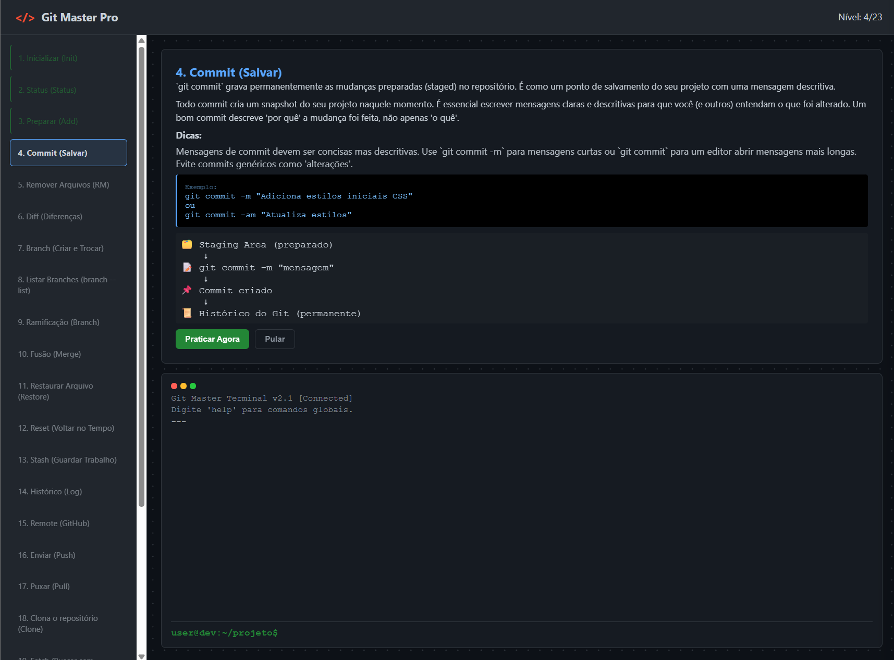

# Git Master Pro

<div align="center">
  
</div>

Uma plataforma interativa de treinamento para dominar Git e GitHub através de tutoriais práticos e missões desafiadoras.

## 📋 Sobre

**Git Master Pro** é um aplicativo educacional desenvolvido para ajudar desenvolvedores a aprender comandos Git de forma progressiva e prática. O projeto oferece uma série de 23 níveis com tutoriais teóricos, diagramas ilustrativos com emojis e missões práticas integradas em um terminal simulado.

## 🎯 Funcionalidades

- **23 Níveis Progressivos**: Estrutura completa de Git básico até operações avançadas
- **Tutoriais Interativos**: Aprenda conceitos de Git passo a passo com explicações detalhadas
- **Diagramas Ilustrativos**: Diagramas ASCII com emojis que visualizam o fluxo de operações Git
- **Dicas Úteis**: Cada nível inclui dicas práticas para facilitar o aprendizado
- **Missões Práticas**: Pratique comandos Git em um ambiente seguro e simulado
- **Progressão por Níveis**: Navegue entre níveis completados ou volte para revisar conteúdo
- **Terminal Simulado**: Interface realista tipo terminal para executar comandos
- **Validação de Comandos**: Validação em tempo real com feedback imediato
- **Histórico de Progresso**: Salva automaticamente seu progresso em localStorage
- **Design Moderno**: Interface escura inspirada em GitHub
- **Acessibilidade**: Navegação por mouse e teclado (Enter/Espaço para ativar níveis)

## 🛠️ Tecnologias

- **HTML5**: Estrutura semântica
- **CSS3**: Estilos responsivos e tema escuro
- **JavaScript**: Lógica interativa e validação de comandos

## 📦 Estrutura do Projeto

```
estagio-git/
├── index.html           # Página principal da aplicação
├── README.md            # Este arquivo
└── src/
    ├── css/
    │   └── style.css    # Estilos e tema escuro
    ├── js/
    │   └── script.js    # Lógica interativa e validação de comandos
    ├── json/
    │   └── levels.json  # Dados de todos os 23 níveis e missões
    └── img/
        └── image.png    # Imagem de demonstração
```

## 🚀 Como Usar

### Opção 1: Abrir Diretamente (Recomendado - com Servidor)

Para melhor compatibilidade com a função `fetch`, use um servidor local:

```bash
# Com Python 3
python -m http.server 8000

# Ou com Node.js (se tiver http-server instalado)
npx http-server -p 8000
```

Depois, abra no navegador: `http://localhost:8000/`

### Opção 2: Abrir no Navegador

- Simplesmente abra o arquivo `index.html` em um navegador moderno

### Como Usar a Plataforma

1. **Selecione um Nível**: Clique em qualquer nível na barra lateral esquerda
2. **Leia o Tutorial**: Estude a descrição, dicas e diagramas do conceito Git
3. **Pratique**: Clique em "Praticar Agora" para iniciar a missão
4. **Execute Comandos**: Digite os comandos Git solicitados no terminal simulado
5. **Avance**: Após completar com sucesso, o próximo nível se desbloqueia automaticamente
6. **Revisão**: Você pode voltar a qualquer nível já completado para revisar

## 📚 Conteúdo do Treinamento

O projeto cobre 23 níveis progressivos de Git:

### Fundamentos (Níveis 1-5)
1. **Inicializar (Init)** - Criar um repositório Git
2. **Status (Status)** - Verificar estado do repositório
3. **Preparar (Add)** - Adicionar arquivos ao stage
4. **Commit (Salvar)** - Gravar mudanças permanentemente
5. **Remover Arquivos (RM)** - Deletar arquivos do repositório

### Comparação e Análise (Níveis 6-7)
6. **Diff (Diferenças)** - Ver mudanças entre versões
7. **Branch (Criar e Trocar)** - Criar branches paralelas

### Gerenciamento de Branches (Níveis 8-11)
8. **Listar Branches** - Listar branches disponíveis
9. **Ramificação (Branch)** - Criar novas branches
10. **Fusão (Merge)** - Integrar branches
11. **Restaurar Arquivo (Restore)** - Desfazer mudanças

### Histórico e Reverter (Níveis 12-14)
12. **Reset (Voltar no Tempo)** - Reverter commits
13. **Stash (Guardar Trabalho)** - Salvar mudanças temporárias
14. **Histórico (Log)** - Visualizar histórico de commits

### Operações Remotas (Níveis 15-19)
15. **Remote (GitHub)** - Conectar repositório remoto
16. **Enviar (Push)** - Enviar commits para GitHub
17. **Puxar (Pull)** - Baixar e integrar mudanças remotas
18. **Clone (Clonar)** - Copiar repositório remoto
19. **Fetch (Buscar)** - Buscar mudanças sem integrar

### Operações Avançadas (Níveis 20-23)
20. **Tag (Versões)** - Marcar versões do projeto
21. **Rebase (Reorganizar)** - Reorganizar histórico de commits
22. **Cherry-pick (Escolher)** - Aplicar commits específicos
23. **Checkout/Switch** - Mudar de branch

## 💡 Como Contribuir

Se deseja contribuir com melhorias:

1. Crie uma nova branch para sua feature: `git checkout -b feat/sua-feature`
2. Faça suas alterações
3. Commit suas mudanças: `git commit -m 'Adiciona nova feature'`
4. Push para a branch: `git push origin feat/sua-feature`
5. Abra um Pull Request

Contribuições, correções e sugestões são bem-vindas!

## 🐛 Bugs e Sugestões

Encontrou um problema ou tem uma sugestão? Abra uma [issue](../../issues) para reportar.

## 📄 Licença

Este projeto é de código aberto e disponível sob a licença MIT.

## 👨‍💻 Autor

**Rodrigo Guedes Fernandes**

- 🌐 Site: [rodrigodev.net](https://rodrigodev.net)
- 💼 GitHub: [@Rodrigogfernandes](https://github.com/Rodrigogfernandes)
- 💬 LinkedIn: [Rodrigo Fernandes](https://www.linkedin.com/in/rodrigogfernandes/)

## ✨ Créditos

Desenvolvido como projeto de estágio com foco em educação em Git e GitHub.

---

**Versão**: 2.0.0  
**Última atualização**: Dezembro 2025

**Features Recentes**:
- ✅ 23 níveis progressivos de Git
- ✅ Diagramas com emojis ilustrativos
- ✅ Navegação interativa entre níveis
- ✅ Dicas e passos detalhados para cada missão
- ✅ Persistência de progresso em localStorage
- ✅ Interface acessível (mouse e teclado)
